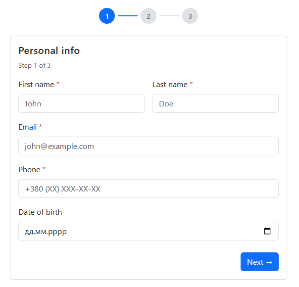
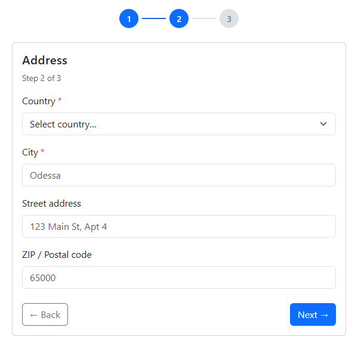
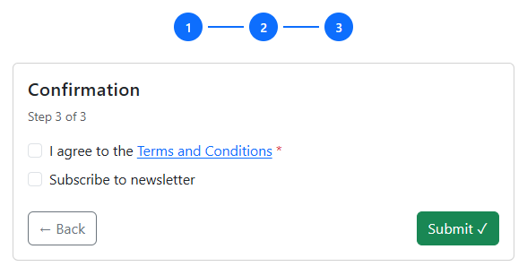
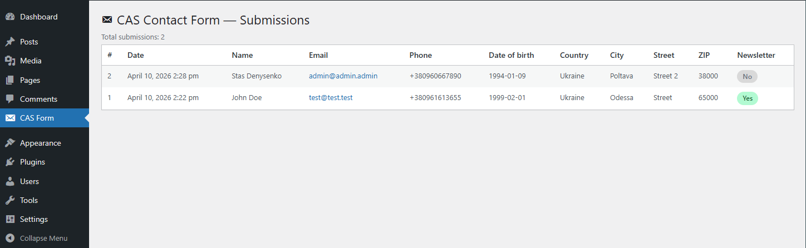

# CAS Contact Form

A WordPress plugin that provides a **multi-step contact form** via the `[cas_contact_form]` shortcode.

---

## Features

- **3-step form**: Personal Info → Address → Confirmation
- Visual step indicator with active / completed states
- Client-side validation (required fields, email format, inline error messages)
- Server-side validation via WordPress AJAX
- Submissions saved to a **custom database table** (`wp_cas_contact_submissions`)
- **Admin page** (sidebar menu) listing all submissions with pagination
- **Email notification** sent to the site admin on every new submission
- Table cleanup on plugin uninstall (`uninstall.php`)
- No Composer / no external PHP dependencies

---

## Installation

1. Download or clone this repository.
2. Copy the `cas-contact-form/` folder into your WordPress installation under `wp-content/plugins/`.
3. In the WordPress admin, go to **Plugins → Installed Plugins** and activate **CAS Contact Form**.
4. Add the shortcode `[cas_contact_form]` to any page or post.

### Requirements

- WordPress 5.8+
- PHP 7.4+
- MySQL 5.6+ / MariaDB 10.1+

---

## Usage

```
[cas_contact_form]
```

Place the shortcode anywhere in your content. The form's CSS and JS are loaded only on the page(s) that contain the
shortcode.

---

## File structure

```
cas-contact-form/
├── admin/
│   └── class-admin-page.php       # Admin menu & submissions table
├── assets/
│   ├── css/
│   │   ├── admin.css              # Admin page styles
│   │   └── form.css               # Frontend form styles
│   └── js/
│       └── form.js                # Multi-step logic & AJAX submit
├── includes/
│   ├── class-ajax-handler.php     # wp_ajax_* handler + server-side validation
│   ├── class-database.php         # Table creation, insert, read
│   ├── class-email.php            # Admin email notification
│   └── class-shortcode.php        # [cas_contact_form] registration & HTML output
├── .gitignore
├── cas-contact-form.php            # Plugin entry point
├── README.md
└── uninstall.php                   # Drops table on plugin deletion
```

---

## Screenshots

*Personal Info step*



*Address step*



*Confirmation step*



*Admin submissions page*



---

## Time spent

~4–5 hours

---

## IDE & extensions

- **PhpStorm** with PHP Inspections, GitToolBox

---

## AI tools used

- **Claude (Anthropic)** — used to scaffold the plugin structure, write the README, and assist with minor code fixes.
